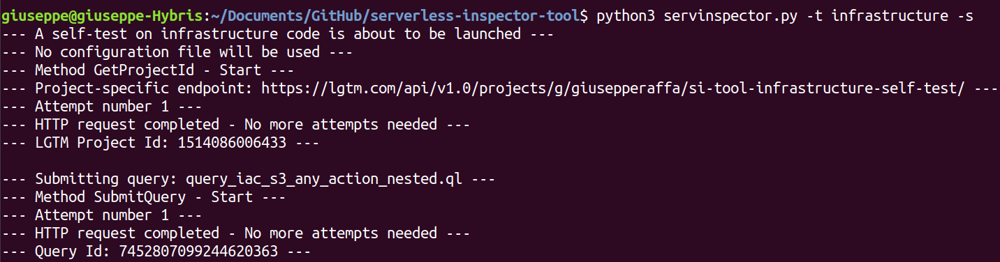

# Serverless Inspector Tool
The Serverless Inspector Tool (SI) tool employs the infrastructure and application code [CodeQL](https://github.com/giusepperaffa/serverless-inspector-tool/tree/main/codeql) queries developed as part of this project to enable automated static analysis of serverless applications.

[Architecture](https://github.com/giusepperaffa/serverless-inspector-tool#architecture) and [implementation](https://github.com/giusepperaffa/serverless-inspector-tool#implementation) of the SI tool are explained in the following sections.

It is important to highlight that this tool was developed and tested with Ubuntu Linux 18.04 LTS and Python 3.6.9. No tests were conducted with Windows or Mac OS.

## Architecture
To facilitate its integration into an IDE, the SI tool has been developed in Python with a command-line interface, which implies that it can also be executed, as shown in [Fig. 1](images/SIToolExecutionExample.png), by using an independent terminal window.

TBD

## Implementation
