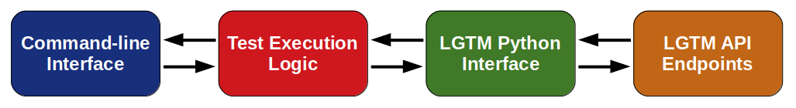
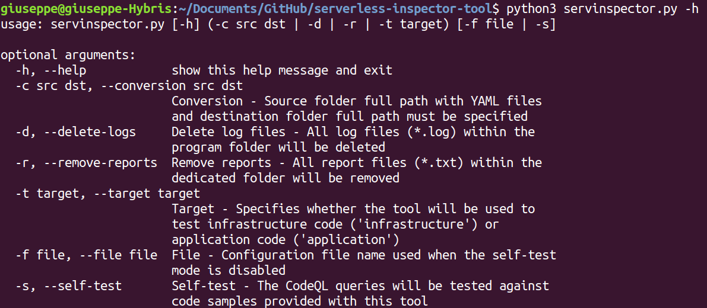

# Serverless Inspector Tool
The Serverless Inspector Tool (SI) tool employs the infrastructure and application code [CodeQL](codeql) queries developed as part of this project to enable automated static analysis of serverless applications.

[Architecture](https://github.com/giusepperaffa/serverless-inspector-tool#architecture) and [implementation](https://github.com/giusepperaffa/serverless-inspector-tool#implementation) of the SI tool are explained in the following sections.

It is important to highlight that this tool was developed and tested with Ubuntu Linux 18.04 LTS and Python 3.6.9. No tests were conducted with Windows or Mac OS.

Finally, as detailed in the following table, where **ST** and **TM** stand for **Self-test Mode** and **Test Mode** respectively, the SI makes use of four additional public repositories to support its operating modes, which are further described [below](https://github.com/giusepperaffa/serverless-inspector-tool#architecture).

| GitHub Link | ST | TM |
| :---: | :---: | :---: |
| [si-tool-application-self-test](https://github.com/giusepperaffa/si-tool-application-self-test) | **Yes** | No |
| [si-tool-application-test](https://github.com/giusepperaffa/si-tool-application-test) | No | **Yes** |
| [si-tool-infrastructure-self-test](https://github.com/giusepperaffa/si-tool-infrastructure-self-test) | **Yes** | No |
| [si-tool-infrastructure-test](https://github.com/giusepperaffa/si-tool-infrastructure-test) | No | **Yes** |  

## Architecture
To facilitate its integration into an IDE, the SI tool has been developed in Python with a command-line interface, which implies that it can also be executed, as shown in below, by using an independent terminal window.

From an architectural point of view, as illustrated in the following diagram, the tool provides an interface towards the [LGTM public API](https://lgtm.com/help/lgtm/api/api-for-lgtm), which allows testing the code included in a given repository with user-specified CodeQL queries. To achieve this, the SI includes a main script (`servinspector.py`), which implements the test execution logic, e.g., the cycle that allows submitting multiple queries, and a Python module (`lgtmreslib.py`) developed by the author to access the above-mentioned API. Separating this functionality from the main script, in fact, facilitates code maintenance and reuse, and it allows creating a generic framework that can be used to run any CodeQL query on a target repository.

As [previously mentioned](https://github.com/giusepperaffa/serverless-inspector-tool#serverless-inspector-tool), the SI makes use of four additional public repositories to support the following three operating modes:

- *Conversion Mode*. This is the mode to be selected in order to convert YAML files into Python dictionaries defined as literals. The dictionaries are stored in .py files. Such conversion is necessary prior to statically analysing infrastructure code, because CodeQL cannot directly process YAML files.

- *Self-test Mode*. When the self-test mode is chosen, the CodeQL queries, which are all stored within the folder [codeql](codeql), are used to test the files included in either `si-tool-application-self-test` or `si-tool-infrastructure-self-test`. As shown in the execution example above, the self-test repository actually analysed has to be selected with the command-line option `-t`. Note that no external tool configuration file is used in self-test mode.

- *Test Mode*. If the test mode is selected, the CodeQL queries are executed to test one of the repositories included in the configuration file specified via the option `-f`. Similarly to the self-test mode, it is the option `-t` that determines the repository actually scanned. A YAML configuration file template, which currently includes the repositories tested as part of this project, can be found within the folder [config](config). Note that the target repositories are specified within the configuration file via their [LGTM URLs](https://lgtm.com/help/lgtm/adding-projects) and not their GitHub URLs.

A summary of all the command-line options, which can be displayed in the used terminal window by using the `-h` or `--help` option, is provided in figure below. Finally, it is worth mentioning that, to improve the user interface, the main script includes a mechanism that detects when incompatible options have been specified.

## Implementation
